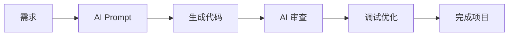

# 🎯 AI Vibe Coding 求职主页

> **核心理念**: 不用学，用 AI 做

## 👋 你好

我是 **AnShun**，专注于 **UE5 + AI 辅助开发**技术栈，正在求职 **UE编辑器开发/Blueprint UI**岗位。

---

## 🎯 目标岗位

### 🔴 首选: UE编辑器开发

- **UE 编辑器开发** (深圳/广州) ⭐⭐⭐⭐⭐ → [[Notes/核心技能/编辑器工具/UE编辑器|UE编辑器]]
- **Blueprint UI 开发** (深圳/广州) ⭐⭐⭐⭐⭐ → [[Notes/核心技能/蓝图UI/UMG基础|UMG基础]]

### 🟡 次选: 技术美术

- **技术美术 TA** (广州) ⭐⭐⭐⭐ → [[Notes/核心技能/蓝图UI/UI材质制作|UI材质]]

---

## 🤖 AI 辅助开发能力

### Vibe Coding 工作流 (新增)

- [[Notes/AI工具/VibeCoding工作流/AI辅助开发流程|AI辅助开发流程]]
- [[Notes/AI工具/VibeCoding工作流/Prompt工程实践|Prompt 工程实践]]
- [[Notes/AI工具/VibeCoding工作流/AI代码审查|AI 代码审查]]

### AI + Blueprint

- [[Notes/AI工具/工具开发/Blueprint编辑器AI|Blueprint 编辑器 AI]]
- [[Notes/AI工具/UE5集成/蓝图代码生成|蓝图代码生成]]

### AI + 特效

- [[Notes/AI工具/工具开发/NiagaraAI助手|Niagara AI 助手]]

---

## 📁 笔记目录

```
Notes/
├── 🤖 AI工具/                    # 🔴 核心
│   ├── VibeCoding工作流/         # 🆕 新增
│   │   ├── AI辅助开发流程.md
│   │   ├── Prompt工程实践.md
│   │   └── AI代码审查.md
│   ├── AI基础/
│   │   ├── AIAgent基础.md
│   │   └── Prompt工程.md
│   ├── UE5集成/
│   │   ├── 蓝图代码生成.md
│   │   └── UE5AI助手.md
│   └── 工具开发/
│       ├── Blueprint编辑器AI.md
│       ├── Blueprint自动化.md
│       └── NiagaraAI助手.md
├── 🎯 核心技能/                  # 🔴 核心
│   ├── 编辑器工具/
│   │   ├── UE编辑器.md
│   │   ├── EUW开发.md
│   │   └── 工具编排.md
│   └── 蓝图UI/
│       ├── UMG基础.md
│       ├── UI材质制作.md
│       ├── 蓝图开发.md
│       └── UMG开发.md
├── 📁 项目作品集/                # 🔴 核心
│   ├── 蓝图UI-HUD系统.md        # 🆕 AI 辅助制作
│   ├── 蓝图UI-主菜单.md         # 🆕 AI 辅助制作
│   ├── 编辑器工具-汽车渲染.md
│   ├── 移动端天气系统.md
│   ├── 智能座舱HMI动效.md
│   ├── 设计比赛HMI.md
│   └── FPS蓝图游戏.md
├── 👤 个人技能/
│   └── 我的技能卡片.md           # 🆕 强调 AI 工具能力
├── 📊 招聘分析/
│   └── Blueprint开发岗位.md
└── 📝 Templates/
    └── 项目经历.md
```

---

## 📊 笔记统计

- **总笔记数**: 28 个
- **AI工具**: 11 篇
- **核心技能**: 8 篇
- **项目作品集**: 7 篇
- **个人技能**: 1 篇
- **招聘分析**: 1 篇
- **Templates**: 1 篇

---

## 💼 适合岗位

1. **UE编辑器开发** (首选) - Blueprint 工具 + AI 辅助
2. **技术美术 (TA向)** - AI 材质/UI 生成
3. **AI 游戏工具开发** - AI Agent 集成

---

## 🎓 Vibe Coding 工作流



> **关键**: 不需要先学完再动手，用 AI 边做边学

---

*最后更新: 2026-03-27*
