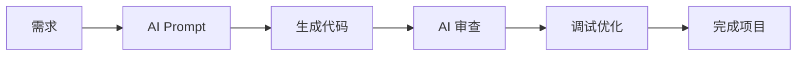

# 我的技能卡片

> **核心理念**: 不用学，用 AI 做

## 🎯 AI 辅助开发能力

### ✅ AI + Blueprint

- Prompt 工程
- AI 代码生成
- AI 代码审查
- AI 辅助调试

### ✅ 蓝图编辑器工具

- Editor Utility Widget (EUW)
- Editor Utility Blueprint
- Blutility 脚本
- UMG 编辑器扩展

### ✅ AI + UI/材质

- AI 生成 UI 布局
- AI 生成材质
- AI 生成 HLSL Shader

### ✅ AI + Niagara

- AI 生成粒子效果
- AI 生成 SDF 效果
- AI 辅助特效调试

---

## 📈 能力雷达图

```
AI Prompt       ████████████ 90%
Blueprint       ████████████ 90%
编辑器工具       ████████████ 90%
UI/材质        █████████░░ 85%
Niagara        █████████░░ 70%
传统编程        ████░░░░░░░░ 30%
```

---

## 🤖 AI 工具栈

| 工具 | 用途 | 熟练度 |
|------|------|--------|
| Claude | 代码生成/审查 | ⭐⭐⭐⭐⭐ |
| Trae AI | 开发助手 | ⭐⭐⭐⭐⭐ |
| ChatGPT | 知识查询 | ⭐⭐⭐⭐ |
| Copilot | 代码补全 | ⭐⭐⭐⭐ |

---

## 🔗 相关笔记

- [[AI工具/VibeCoding工作流/AI辅助开发流程|AI辅助开发流程]]
- [[AI工具/UE5集成/蓝图代码生成|蓝图代码生成]]
- [[AI工具/工具开发/NiagaraAI助手|Niagara AI 助手]]

---

## 📁 项目作品集 (AI 辅助制作)

### 编辑器工具/工作流

- [[项目经历/汽车渲染工具|编辑器工具-汽车渲染]] - AI 辅助开发

### UI 系统

- [[蓝图UI- HUD 背包 设置 结算|HUD系统]] - AI 辅助制作
- [[项目经历/蓝图UI-主菜单|主菜单系统]] - AI 辅助制作

### 游戏项目

- [[《寒刃协议》项目主页|FPS 蓝图游戏]] - AI 辅助开发
- [[项目经历/移动端天气系统|天气系统]] - AI 辅助制作

### HMI/动效

- [[Notes/项目经历/# 智能座舱 Niagara 概念特效|智能座舱 Niagara]] - AI 辅助制作
- [[项目经历/设计比赛HMI|HMI设计比赛]] - AI 辅助制作

---

## 💼 适合岗位

1. **UE编辑器开发** (首选) - Blueprint 工具 + AI 辅助
2. **技术美术 (TA向)** - AI 材质/UI 生成
3. **AI 游戏工具开发** - AI Agent 集成
4. **HMI 开发** - AI 辅助 UI/动效制作

---

## 🎓 Vibe Coding 工作流



> **关键**: 不需要先学完再动手，用 AI 边做边学


